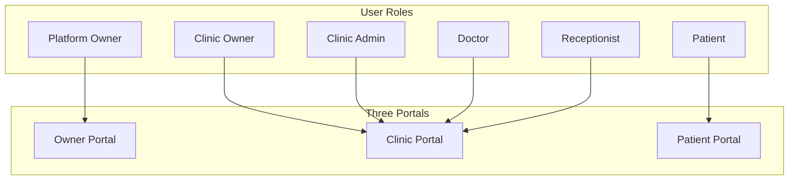
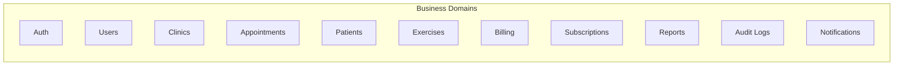
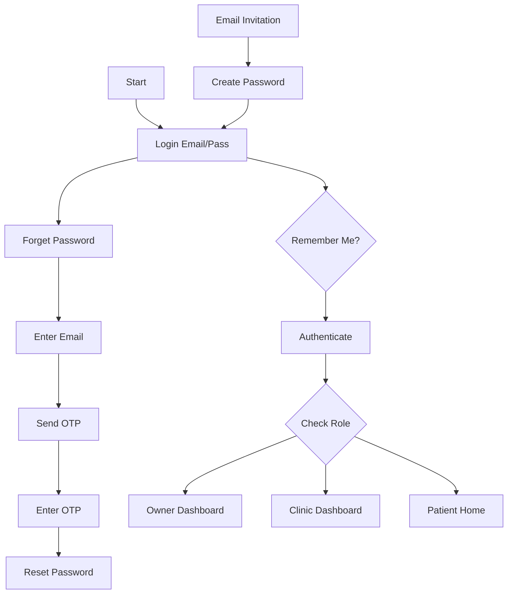
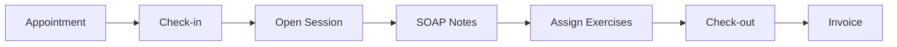
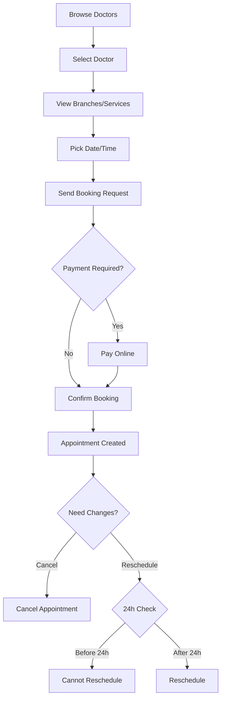
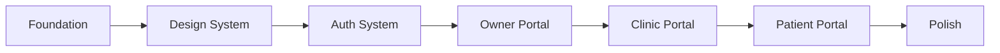

# Rehably Frontend Architecture Plan (Complete)

## System Overview



## Domains Architecture



## Tech Stack

| Layer | Technology |
|-------|------------|
| Framework | Next.js 14+ (App Router) |
| Language | TypeScript |
| Styling | TailwindCSS + CSS Variables |
| State | Zustand (Client State) |
| Auth | Custom JWT Auth (not NextAuth) |
| i18n | next-intl (Arabic RTL + English) |
| Forms | React Hook Form + Zod |
| Video | React Player (for exercises) |
| UI Components | Custom Design System |
| HTTP Client | Axios with interceptors |

---

## Multi-Tenant Subdomain Architecture

### Domain Structure

| Subdomain | Portal | Description |
|-----------|--------|-------------|
| `platform.rehably.com` | Owner Portal | Platform Admin dashboard |
| `{clinic-slug}.rehably.com` | Clinic Portal | Clinic staff dashboard (e.g., `alnoor.rehably.com`) |
| `portal.{clinic-slug}.rehably.com` | Patient Portal | Patient booking & exercises |
| `{custom-domain.com}` | Clinic (Custom) | Clinic with custom domain |

### Portal-Role Mapping

| Portal | Allowed Roles | Login Method |
|--------|---------------|--------------|
| Owner | PlatformAdmin | Email + Password |
| Clinic | ClinicOwner, ClinicAdmin, Doctor, Receptionist | Email + Password |
| Patient | Patient | Phone + OTP (different UI) |

### Tenant Detection Flow

```
Request comes in: clinic1.rehably.com/dashboard
                          │
                          ▼
            ┌─────────────────────────┐
            │  middleware.ts          │
            │  Extract subdomain      │
            │  subdomain = "clinic1"  │
            └─────────────────────────┘
                          │
                          ▼
            ┌─────────────────────────┐
            │  Determine portal type  │
            │  "platform" → Owner     │
            │  "portal.*" → Patient   │
            │  else → Clinic          │
            └─────────────────────────┘
                          │
                          ▼
            ┌─────────────────────────┐
            │  Validate user role     │
            │  matches portal type    │
            └─────────────────────────┘
```

---

## Authentication System

### Backend API (http://rehably.runasp.net)

| Endpoint | Method | Purpose |
|----------|--------|---------|
| `/api/Auth/login` | POST | Login with email + password |
| `/api/Auth/login-via-otp` | POST | Request OTP for phone login |
| `/api/Auth/verify-otp-login` | POST | Verify OTP and get tokens |
| `/api/Auth/logout` | POST | Logout (invalidate token) |
| `/api/Auth/refresh` | POST | Refresh access token |
| `/api/Auth/me` | GET | Get current user info |
| `/api/Auth/forgot-password` | POST | Request password reset |
| `/api/Auth/reset-password` | POST | Reset password with OTP |
| `/api/Auth/resend-otp` | POST | Resend OTP |
| `/api/Auth/change-password` | POST | Change password |

### Token Structure

**Login Response:**
```json
{
  "success": true,
  "data": {
    "accessToken": "eyJhbGciOiJIUzI1NiIs...",
    "refreshToken": "5SBbgvGNzPw3V8AlbkHp...",
    "expiresAt": "2026-02-01T06:26:28.888Z",
    "mustChangePassword": false,
    "emailVerified": true
  }
}
```

**User Response (/api/Auth/me):**
```json
{
  "success": true,
  "data": {
    "id": "test-admin-001",
    "email": "admin@rehably.com",
    "firstName": "Platform",
    "lastName": "Admin",
    "fullName": "Platform Admin",
    "roles": ["PlatformAdmin"],
    "tenantId": null,
    "clinicId": null,
    "isActive": true,
    "mustChangePassword": false,
    "emailVerified": true
  }
}
```

### JWT Token Claims

The access token contains:
- `role`: User role (PlatformAdmin, ClinicOwner, etc.)
- `Permission`: Array of permissions (dashboard.view, clinics.create, etc.)
- `exp`: Expiration timestamp

### Auth Flows

**Flow 1: Owner/Clinic Staff Login (Email + Password)**
```
User enters email + password
        │
        ▼
POST /api/Auth/login
        │
        ▼
Receive { accessToken, refreshToken }
        │
        ▼
Store tokens in localStorage + Zustand
        │
        ▼
GET /api/Auth/me
        │
        ▼
Get user data with roles
        │
        ▼
Redirect based on role:
  - PlatformAdmin → /home (Owner Portal)
  - ClinicOwner/Admin/Doctor/Receptionist → /clinic/dashboard
```

**Flow 2: Patient Login (Phone + OTP)**
```
User enters phone number
        │
        ▼
POST /api/Auth/login-via-otp
        │
        ▼
OTP sent to phone
        │
        ▼
User enters OTP
        │
        ▼
POST /api/Auth/verify-otp-login
        │
        ▼
Receive { accessToken, refreshToken }
        │
        ▼
Redirect to /patient/home
```

**Flow 3: Password Reset**
```
User clicks "Forgot Password"
        │
        ▼
Enter email → POST /api/Auth/forgot-password
        │
        ▼
OTP sent to email
        │
        ▼
Enter OTP + new password → POST /api/Auth/reset-password
        │
        ▼
Redirect to login
```

### Token Storage Strategy

| What | Where | Why |
|------|-------|-----|
| accessToken | localStorage + Zustand | API calls + persistence |
| refreshToken | localStorage + Zustand | Token refresh |
| user | Zustand (memory) | UI display, fetched fresh |

### Auto Token Refresh

```
API request with accessToken
        │
        ▼
Backend returns 401 (token expired)
        │
        ▼
Axios interceptor catches 401
        │
        ▼
POST /api/Auth/refresh with refreshToken
        │
        ▼
Receive new accessToken
        │
        ▼
Retry original request
```

### Frontend Auth Files

```
src/
├── middleware.ts                    # Route protection + subdomain detection
├── shared/types/auth.types.ts       # Auth interfaces
├── shared/utils/subdomain.utils.ts  # Subdomain helpers
├── services/api-client.ts           # Axios + interceptors
├── services/auth.service.ts         # Auth API calls
├── stores/auth.store.ts             # Zustand auth store
└── ui/components/LoginForm/         # Login UI (email+password)
    └── PatientLoginForm/            # Patient login UI (phone+OTP)
```

---

## User Roles and Permissions

| Role | Portal | Capabilities |
|------|--------|--------------|
| Platform Owner | Owner | Full system control, clinics, plans, billing |
| Clinic Owner | Clinic | Full clinic control, staff, branches |
| Clinic Admin | Clinic | Staff, branches, services, reports |
| Doctor | Clinic | Schedule, patients, SOAP notes, exercises |
| Receptionist | Clinic | Appointments, check-in/out, payments |
| Patient | Patient | Booking, exercises, payments, profile |

---

## Critical Business Rules

| Rule | Description |
|------|-------------|
| 24h Reschedule | Cannot reschedule appointment before 24 hours |
| OTP Required | Password reset requires OTP via email |
| First Visit | New users must create password on first login |
| Room Assignment | Appointment requires Room + Doctor |
| Session Lifecycle | Check-in → Session → SOAP → Exercises → Check-out → Invoice |

---

## Phase 1: Project Foundation

### 1.1 Initialize Project Structure

```
src/
├── app/
│   ├── [locale]/                 # i18n routing
│   │   ├── (auth)/              # Login, OTP, Reset, Create Password
│   │   ├── (owner)/             # Platform Owner Portal
│   │   ├── (clinic)/            # Clinic Staff Portal
│   │   └── (patient)/           # Patient Portal
│   ├── api/auth/[...nextauth]/   # NextAuth API
│   └── globals.css
│
├── domains/                      # Business Logic
│   ├── auth/
│   ├── users/
│   ├── clinics/
│   ├── appointments/
│   ├── patients/
│   ├── exercises/
│   ├── billing/
│   ├── subscriptions/
│   ├── reports/
│   ├── audit/
│   └── notifications/
│
├── permissions/
├── services/
├── ui/
├── shared/
├── stores/
└── configs/
```

### 1.2 Core Configuration Files

- `tailwind.config.ts` - with CSS variables for theming
- `next.config.js` - with i18n setup
- `middleware.ts` - for auth protection and locale detection
- `.env.local` - API URLs and secrets

### 1.3 Theme System

```typescript
// configs/theme.config.ts
// CSS Variables approach for dynamic colors
// --color-primary, --color-secondary
// Dark mode via class toggle
```

---

## Phase 2: Design System (UI Layer)

### 2.1 Primitives

| Component | Variants |
|-----------|----------|
| Button | primary, secondary, outline, ghost, danger |
| Input | text, email, password, search, textarea |
| Select | single, multi |
| Checkbox | default, switch |
| Badge | success, warning, error, info |

### 2.2 Components

| Component | Purpose |
|-----------|---------|
| Card | Content containers |
| Table | Data tables with sorting/pagination |
| Modal | Dialogs and confirmations |
| Dropdown | Menus and actions |
| Tabs | Section navigation |
| Charts | Revenue, statistics |
| Avatar | User images |
| Toast | Notifications |

### 2.3 Layouts

| Layout | Usage |
|--------|-------|
| AuthLayout | Login, Reset Password |
| DashboardLayout | Main dashboard with Sidebar |
| Sidebar | Navigation per role |
| Header | Search, Notifications, Profile |

---

## Phase 3: Authentication and Permissions

### 3.1 Auth Flows



### 3.2 Permission System

```typescript
// permissions/roles.ts
type Role = 
  | 'platform_owner'
  | 'clinic_owner'
  | 'clinic_admin'
  | 'doctor'
  | 'receptionist'
  | 'patient'
```

### 3.3 Session Lifecycle (Visit Flow)



---

## Phase 4: Owner Portal Implementation

### 4.1 Routes Structure

```
app/[locale]/(owner)/
├── dashboard/
├── clinics/
│   ├── page.tsx              # Clinics List
│   ├── [id]/page.tsx         # Clinic Details
│   ├── [id]/edit/page.tsx    # Edit Clinic
│   └── new/page.tsx          # Add Clinic (Send Invitation)
├── subscriptions/
│   ├── plans/                # Create/Edit Plans
│   ├── billing/              # Billing History + Alerts
│   └── requests/             # Accept/Decline Requests
├── audit-logs/               # Activity tracking per clinic
├── reports/                  # Revenue, Feedbacks
├── settings/                 # Backups, Language
└── profile/                  # Platform Name, Logo, Password
```

### 4.2 Owner Domains

| Domain | Responsibilities |
|--------|-----------------|
| clinics | Clinic entity, invitation logic, ban rules |
| plans | Plan creation, features, pricing |
| billing | Payment status, alerts, history |
| audit | Activity tracking, logs |

---

## Phase 5: Clinic Portal Implementation

### 5.1 Routes Structure

```
app/[locale]/(clinic)/
├── dashboard/                # KPIs, Quick Actions
├── doctors/
│   ├── page.tsx             # List with schedule
│   ├── [id]/page.tsx        # Doctor details, patients
│   └── [id]/schedule/       # Doctor schedule management
├── patients/
│   ├── page.tsx             # Patients list
│   ├── [id]/page.tsx        # Patient profile
│   ├── [id]/history/        # Medical history
│   └── [id]/progress/       # Progress tracking
├── appointments/
│   ├── page.tsx             # Calendar view
│   ├── new/page.tsx         # Create appointment
│   └── [id]/page.tsx        # Appointment details
├── visits/
│   ├── page.tsx             # Sessions list
│   └── [id]/page.tsx        # Session details + SOAP
├── exercises/
│   ├── page.tsx             # Exercise library
│   ├── new/page.tsx         # Upload video + instructions
│   └── [id]/page.tsx        # Exercise details
├── staff/                   # Staff management + roles
├── branches/                # Branches + rooms
├── equipments/              # Equipment inventory
├── finance/
│   ├── billing/             # Billing history
│   ├── invoices/            # Generate/print invoices
│   ├── offers/              # Packages and offers
│   └── insurance/           # Insurance setup
├── subscription/            # Current plan, storage
├── audit-logs/              # Activity logs
├── settings/                # Clinic settings
└── profile/                 # Clinic profile, theme
```

### 5.2 Role-based Access in Clinic Portal

| Module | Clinic Owner | Clinic Admin | Doctor | Receptionist |
|--------|--------------|--------------|--------|--------------|
| Dashboard | Full | Full | Limited | Limited |
| Doctors | CRUD | CRUD | Read Own | Read |
| Patients | CRUD | CRUD | Read Assigned | Read |
| Appointments | Full | Full | Read Own | CRUD |
| Visits/Sessions | Full | Full | CRUD Own | Read |
| Exercises | Full | Full | CRUD | Read |
| Staff | CRUD | CRUD | - | - |
| Branches | CRUD | CRUD | - | - |
| Finance | Full | Full | - | Collect Payment |
| Settings | Full | Limited | - | - |

---

## Phase 6: Patient Portal Implementation

### 6.1 Routes Structure

```
app/[locale]/(patient)/
├── home/                    # Welcome, upcoming appointments
├── booking/
│   ├── page.tsx            # Browse doctors/services
│   ├── [doctorId]/         # Doctor profile + availability
│   └── confirm/            # Confirm booking + payment
├── appointments/
│   ├── page.tsx            # Upcoming / Past
│   └── [id]/page.tsx       # Appointment details
├── exercises/
│   ├── page.tsx            # Assigned exercises
│   └── [id]/page.tsx       # Video player + instructions
├── payments/
│   ├── page.tsx            # Payment history
│   ├── pay/                # Pay upcoming session
│   └── invoices/           # Download invoices
├── profile/                 # Personal info
├── settings/                # Notifications, language
└── notifications/           # All notifications
```

### 6.2 Patient Booking Flow



---

## Phase 7: API Integration

### 7.1 Services Layer

```typescript
// services/api-client.ts
// Axios configured with JWT interceptor

// services/[domain].service.ts
export const appointmentsService = {
  getAll: (params) => api.get('/appointments', { params }),
  getById: (id) => api.get(`/appointments/${id}`),
  create: (data) => api.post('/appointments', data),
  reschedule: (id, data) => api.patch(`/appointments/${id}/reschedule`, data),
  cancel: (id) => api.patch(`/appointments/${id}/cancel`),
}
```

### 7.2 Services List

| Service | Endpoints |
|---------|-----------|
| auth.service | login, logout, forgotPassword, resetPassword, verifyOTP |
| clinics.service | CRUD, ban, invite, assignPlan |
| doctors.service | CRUD, schedule, assignPatients |
| patients.service | CRUD, medicalHistory, progress |
| appointments.service | CRUD, reschedule, cancel, checkIn, checkOut |
| visits.service | CRUD, soapNotes, assignExercises |
| exercises.service | CRUD, uploadVideo, markComplete |
| billing.service | invoices, payments, offers, insurance |
| subscriptions.service | plans, upgrade, cancel, alerts |
| audit.service | logs, activities |
| notifications.service | list, markRead |

---

## Key Files to Create First

1. `package.json` - Dependencies
2. `tailwind.config.ts` - Theme with CSS variables
3. `middleware.ts` - Auth + i18n middleware
4. `src/configs/theme.config.ts` - Dynamic colors
5. `src/permissions/roles.ts` - 6 roles definition
6. `src/permissions/capabilities.ts` - Per-module permissions
7. `src/stores/auth.store.ts` - Auth state
8. `src/stores/theme.store.ts` - Theme + dark mode
9. `src/shared/i18n/` - Arabic + English translations
10. `src/ui/primitives/` - Base components

---

## Development Order



| Phase | Estimated Effort |
|-------|-----------------|
| Foundation | 1-2 days |
| Design System | 3-4 days |
| Auth System | 2-3 days |
| Owner Portal | 5-7 days |
| Clinic Portal | 10-14 days |
| Patient Portal | 5-7 days |
| Polish | 2-3 days |
| **Total** | **28-40 days** |

---

## Complete Folder Structure

```
src/
├── app/
│   ├── [locale]/
│   │   ├── (auth)/              # Shared auth pages
│   │   │   ├── login/
│   │   │   ├── forgot-password/
│   │   │   ├── reset-password/
│   │   │   ├── verify-otp/
│   │   │   └── create-password/
│   │   │
│   │   ├── (owner)/             # Platform Owner Portal
│   │   │   ├── dashboard/
│   │   │   ├── clinics/
│   │   │   ├── subscriptions/
│   │   │   ├── audit-logs/
│   │   │   ├── reports/
│   │   │   ├── settings/
│   │   │   └── profile/
│   │   │
│   │   ├── (clinic)/            # Clinic Staff Portal
│   │   │   ├── dashboard/
│   │   │   ├── doctors/
│   │   │   ├── patients/
│   │   │   ├── appointments/
│   │   │   ├── visits/
│   │   │   ├── exercises/
│   │   │   ├── staff/
│   │   │   ├── branches/
│   │   │   ├── equipments/
│   │   │   ├── finance/
│   │   │   ├── subscription/
│   │   │   ├── audit-logs/
│   │   │   ├── settings/
│   │   │   └── profile/
│   │   │
│   │   └── (patient)/           # Patient Portal
│   │       ├── home/
│   │       ├── booking/
│   │       ├── appointments/
│   │       ├── exercises/
│   │       ├── payments/
│   │       ├── profile/
│   │       ├── settings/
│   │       └── notifications/
│   │
│   ├── api/auth/[...nextauth]/
│   └── globals.css
│
├── domains/                      # Business Logic (Pure TS)
│   ├── auth/
│   │   ├── auth.types.ts
│   │   ├── auth.rules.ts        # OTP required, first-visit password
│   │   └── auth.utils.ts
│   ├── appointments/
│   │   ├── appointments.types.ts
│   │   ├── appointments.rules.ts # 24h reschedule rule
│   │   └── appointments.utils.ts
│   ├── visits/
│   │   ├── visits.types.ts
│   │   ├── visits.rules.ts      # Session lifecycle
│   │   └── soap.types.ts
│   ├── billing/
│   ├── clinics/
│   ├── doctors/
│   ├── exercises/
│   ├── patients/
│   ├── subscriptions/
│   └── notifications/
│
├── permissions/
│   ├── roles.ts                 # 6 roles
│   ├── capabilities.ts          # Per-module permissions
│   ├── guards.tsx               # React guard components
│   └── hooks.ts                 # usePermission, useRole
│
├── services/
│   ├── api-client.ts
│   ├── auth.service.ts
│   ├── appointments.service.ts
│   ├── billing.service.ts
│   ├── clinics.service.ts
│   ├── doctors.service.ts
│   ├── exercises.service.ts
│   ├── patients.service.ts
│   ├── subscriptions.service.ts
│   ├── visits.service.ts
│   └── mocks/                   # Mock data for development
│
├── ui/
│   ├── primitives/
│   │   ├── Button/
│   │   ├── Input/
│   │   ├── Select/
│   │   ├── Checkbox/
│   │   ├── Badge/
│   │   └── index.ts
│   ├── components/
│   │   ├── Card/
│   │   ├── Table/
│   │   ├── Modal/
│   │   ├── Dropdown/
│   │   ├── Tabs/
│   │   ├── Calendar/
│   │   ├── VideoPlayer/
│   │   ├── Charts/
│   │   ├── Avatar/
│   │   ├── Toast/
│   │   └── index.ts
│   └── layouts/
│       ├── AuthLayout.tsx
│       ├── DashboardLayout.tsx
│       ├── PatientLayout.tsx
│       ├── Sidebar.tsx
│       └── Header.tsx
│
├── shared/
│   ├── hooks/
│   │   ├── useAuth.ts
│   │   ├── useTheme.ts
│   │   └── useLocale.ts
│   ├── utils/
│   │   ├── date.utils.ts
│   │   ├── format.utils.ts
│   │   └── validation.utils.ts
│   ├── types/
│   │   └── common.types.ts
│   └── i18n/
│       ├── ar.json
│       └── en.json
│
├── stores/
│   ├── auth.store.ts
│   ├── theme.store.ts
│   └── ui.store.ts
│
└── configs/
    ├── navigation.ts            # Menu items per role
    ├── theme.config.ts          # CSS variables
    └── app.config.ts
```

