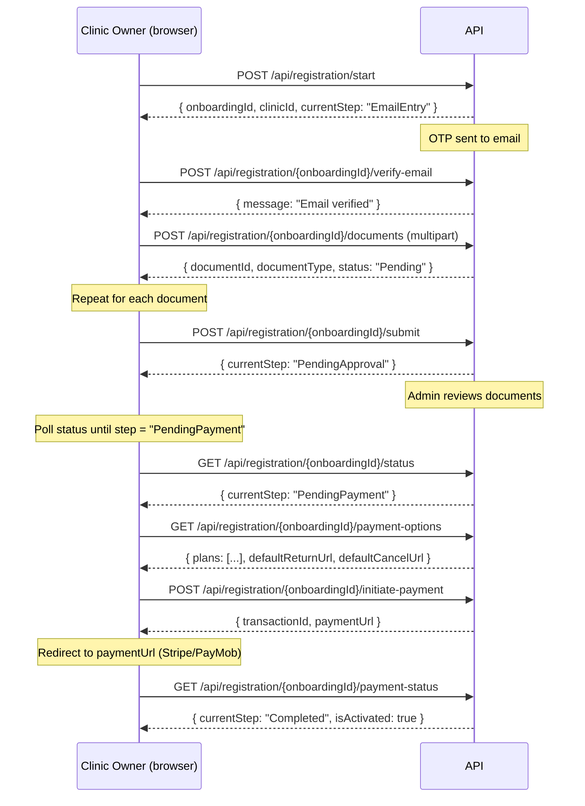

# Rehably API — Business Flow Guide

**Audience:** React / Next.js frontend developers
**Base URL:** `http://rehably.runasp.net` (production) | `https://localhost:5001` (local)
**Auth:** JWT Bearer tokens — `Authorization: Bearer <accessToken>`
**Content-Type:** `application/json` (unless noted as multipart)

---

## Table of Contents

1. [System Overview](#1-system-overview)
2. [Auth Model — Tokens & Storage](#2-auth-model)
3. [API Response Shape](#3-api-response-shape)
4. [Journey 1 — Public Visitor](#4-journey-1-public-visitor)
5. [Journey 2 — Clinic Self-Registration (6 steps)](#5-journey-2-clinic-self-registration)
6. [Journey 3 — Admin Platform](#6-journey-3-admin-platform)
7. [Journey 4 — Tenant / Clinic Owner](#7-journey-4-tenant--clinic-owner)
8. [OTP & Passwordless Login Flows](#8-otp--passwordless-flows)
9. [Password Reset Flow](#9-password-reset-flow)
10. [Rate Limits](#10-rate-limits)
11. [Error Reference](#11-error-reference)

---

## 1. System Overview

Rehably is a **multi-tenant SaaS** platform for physiotherapy clinic management. It has two types of users:

| Actor | Who | Portal |
|-------|-----|--------|
| **Platform Admin** | Rehably staff | Admin panel — manages clinics, packages, library |
| **Tenant User** | Clinic owner + staff | Clinic dashboard — manages their own clinic |

### User Role Hierarchy

```
Platform Admin
    └── PlatformOwner  (super admin, can unban clinics)
    └── PlatformAdmin  (standard admin)
    └── PlatformSupport (read-only support)

Tenant (Clinic) Users
    └── Owner       (clinic owner, all permissions)
    └── Admin       (clinic admin)
    └── Therapist   (standard user)
    └── Receptionist
```

### Two Portals, One API

The same login endpoint (`POST /api/auth/login`) handles both admin and tenant logins. The JWT claims tell the server which type of user is calling.

- **Admin token:** has `platform_role` claim → unlocks `/api/admin/*` routes
- **Tenant token:** has `tenant_id` + `clinic_id` claims → unlocks `/api/tenant/*` routes

---

## 2. Auth Model

### Token Storage (React recommendation)

```
accessToken  → memory (useState / Zustand store) — NOT localStorage
refreshToken → httpOnly cookie OR localStorage (acceptable for SaaS)
expiresAt    → memory (for proactive refresh)
```

> **Security note:** Never store `accessToken` in localStorage — it is XSS-vulnerable. Store it in memory and refresh when the app loads using the `refreshToken`.

### Token Lifecycle

```
Login ──→ { accessToken, refreshToken, expiresAt }
              │
              ├── Use accessToken for all authenticated requests
              │
              └── When expired → POST /api/auth/refresh with refreshToken
                                     │
                                     └── Get new { accessToken, refreshToken, expiresAt }
```

### Axios Interceptor Pattern

```js
// Auto-refresh on 401
axios.interceptors.response.use(null, async (error) => {
  if (error.response?.status === 401 && !error.config._retry) {
    error.config._retry = true;
    const { data } = await axios.post('/api/auth/refresh', { refreshToken });
    setAccessToken(data.data.accessToken);
    error.config.headers.Authorization = `Bearer ${data.data.accessToken}`;
    return axios(error.config);
  }
  return Promise.reject(error);
});
```

---

## 3. API Response Shape

All endpoints return one of these two shapes:

### Success Response

```json
{
  "success": true,
  "data": { ... }
}
```

### Error Response

```json
{
  "success": false,
  "error": {
    "code": "VALIDATION_ERROR",
    "message": "Human-readable message",
    "details": ["field: error description"]
  }
}
```

> **Important:** Some endpoints (especially older ones) return the data directly without the `{ success, data }` wrapper. Always check `response.data?.data ?? response.data` when parsing.

### Common Error Codes

| Code | Meaning |
|------|---------|
| `VALIDATION_ERROR` | Request body failed validation |
| `NOT_FOUND` | Resource does not exist |
| `UNAUTHORIZED` | No/invalid JWT token |
| `FORBIDDEN` | Valid token but wrong permissions |
| `INTERNAL_ERROR` | Login failed (wrong credentials) |
| `BUSINESS_RULE_VIOLATION` | Business logic rejected the action |
| `TOKEN_EXPIRED` | OTP/reset token expired |
| `INVALID_TOKEN` | OTP/reset token invalid |
| `RATE_LIMITED` | OTP resend cooldown active |

---

## 4. Journey 1 — Public Visitor

No authentication required. Use these endpoints for your **landing page / pricing page**.

### 4.1 Browse Packages

```
GET /api/public/packages
```

Returns all **active, public** packages ordered by price ascending. Cached for 5 minutes.

**Response:**
```json
{
  "success": true,
  "data": [
    {
      "id": "uuid",
      "name": "Starter",
      "description": "...",
      "monthlyPrice": 99.00,
      "yearlyPrice": 990.00,
      "trialDays": 14,
      "isActive": true,
      "displayOrder": 1
    }
  ]
}
```

### 4.2 Get Package Details (with features list)

```
GET /api/public/packages/{id}/details
```

Returns the package + all features included in it. Use this for your **pricing page card** when a user clicks "See what's included".

### 4.3 Feature Catalog

```
GET /api/public/feature-catalog              → All categories + features
GET /api/public/feature-catalog/features     → Flat list of all features
GET /api/public/feature-catalog/features/{id}/pricing        → Single feature price
GET /api/public/feature-catalog/features/{id}/with-pricing   → Feature + price combined
```

### 4.4 Pricing Calculator

Use this for a **"Build your plan"** interactive calculator:

```
POST /api/public/package-calculator/packages/{packageId}/calculate
```

**Request body:**
```json
{
  "billingCycle": "Monthly",   // "Monthly" | "Yearly"
  "addOnFeatureIds": ["uuid1", "uuid2"]
}
```

**Returns:** `decimal` — total price only.

For a full breakdown with line items:

```
POST /api/public/package-calculator/packages/{packageId}/breakdown
```

**Request body:**
```json
{
  "billingCycle": "Yearly",
  "countryCode": "EG",         // ISO country code for tax calculation
  "addOnFeatureIds": ["uuid1"]
}
```

**Response:**
```json
{
  "basePrice": 990.00,
  "addOns": [{ "name": "Extra Storage", "price": 120.00 }],
  "subtotal": 1110.00,
  "taxRate": 0.14,
  "taxAmount": 155.40,
  "total": 1265.40,
  "yearlySavings": 228.00
}
```

---

## 5. Journey 2 — Clinic Self-Registration

This is a **6-step wizard**. The server enforces step order — you cannot skip steps. Store the `onboardingId` in state throughout.

### Step State Machine

```
EmailEntry → EmailVerified → DocumentsUploaded → PendingApproval → PendingPayment → Completed
```

### Sequence Diagram



### Step-by-Step API Reference

#### Step 1 — Start Registration

```
POST /api/registration/start
```

```json
{
  "clinicName": "Rehab Center Cairo",
  "email": "owner@clinic.com",
  "phone": "+201001234567",
  "ownerFirstName": "Ahmed"
}
```

**Response:**
```json
{
  "onboardingId": "uuid",
  "clinicId": "uuid",
  "currentStep": "EmailEntry",
  "message": "Registration started. Please check your email for OTP verification."
}
```

> Save `onboardingId` — you'll need it for all following steps.

#### Step 2 — Verify Email (OTP)

```
POST /api/registration/{onboardingId}/verify-email
```

```json
{ "otp": "123456" }
```

#### Step 3 — Upload Documents

```
POST /api/registration/{onboardingId}/documents
Content-Type: multipart/form-data

file: <File>
documentType: "CommercialRegister"  // or "TaxCard" | "MedicalLicense" | "NationalId"
```

**Response:**
```json
{
  "documentId": "uuid",
  "documentType": "CommercialRegister",
  "status": "Pending"
}
```

> Upload each document separately. You can upload multiple documents before submitting.

#### Step 4 — Submit for Approval

```
POST /api/registration/{onboardingId}/submit
```

No body. Sets `currentStep` to `PendingApproval`.

#### Wait for Admin Approval

Poll the status endpoint every 30 seconds (or use a refresh button):

```
GET /api/registration/{onboardingId}/status
```

**Response:**
```json
{
  "onboardingId": "uuid",
  "clinicId": "uuid",
  "currentStep": "PendingPayment",
  "emailVerifiedAt": "2026-03-04T10:00:00Z",
  "documentsUploadedAt": "2026-03-04T10:05:00Z",
  "approvedAt": "2026-03-04T11:00:00Z",
  "paymentCompletedAt": null
}
```

Wait until `currentStep === "PendingPayment"` before showing payment UI.

#### Step 5 — Get Payment Options & Choose Plan

```
GET /api/registration/{onboardingId}/payment-options
```

**Response:**
```json
{
  "onboardingId": "uuid",
  "clinicId": "uuid",
  "plans": [
    {
      "id": "uuid",
      "name": "Starter",
      "monthlyPrice": 99.00,
      "yearlyPrice": 990.00,
      "trialDays": 14
    }
  ],
  "defaultReturnUrl": "http://server/registration/{id}/payment-success",
  "defaultCancelUrl": "http://server/registration/{id}/payment-cancel"
}
```

Then initiate payment:

```
POST /api/registration/{onboardingId}/initiate-payment
```

```json
{
  "subscriptionPlanId": "uuid",
  "providerKey": "stripe",           // "stripe" | "paymob"
  "returnUrl": "https://yourapp.com/registration/success",
  "cancelUrl": "https://yourapp.com/registration/cancelled"
}
```

**Response:**
```json
{
  "transactionId": "uuid",
  "paymentUrl": "https://checkout.stripe.com/pay/...",
  "message": "Payment initiated. Redirect to payment URL to complete payment."
}
```

> **Redirect the user** to `paymentUrl` — this opens Stripe/PayMob checkout.

#### Step 6 — Confirm Payment

After user returns from the payment page:

```
GET /api/registration/{onboardingId}/payment-status
```

**Response:**
```json
{
  "currentStep": "Completed",
  "paymentStatus": "Succeeded",
  "isActivated": true,
  "paymentCompletedAt": "2026-03-04T11:15:00Z"
}
```

When `isActivated === true` and `currentStep === "Completed"`, the clinic is active. Send the user to the login screen.

---

## 6. Journey 3 — Admin Platform

**Requires:** Admin JWT token (obtained via standard login with platform admin credentials).
**Permission attribute used server-side:** `[RequirePermission("platform.manage_clinics")]`

### 6.1 Login as Admin

```
POST /api/auth/login
{ "email": "admin@rehably.com", "password": "..." }
```

### 6.2 Clinic Management

#### List All Clinics

```
GET /api/admin/clinics?page=1&pageSize=20&search=cairo&status=Active
```

Query params: `search` (supports Arabic), `status` (Active | Suspended | Banned | Pending), `page`, `pageSize`.

#### Create Clinic (Admin-Initiated)

```
POST /api/admin/clinics
```

This runs the **full clinic activation saga** — creates clinic, subscription, records payment, activates, sends welcome email.

```json
{
  "clinicName": "Elite Rehab",
  "phone": "+201009876543",
  "packageId": "uuid",
  "ownerEmail": "owner@elite.com",
  "ownerFirstName": "Sara",
  "ownerLastName": "Hassan",
  "billingCycle": "Monthly",   // "Monthly" | "Yearly"
  "paymentType": "Cash"        // "Cash" | "Stripe" | "PayMob"
}
```

**Response:** `201 Created` with clinic details.

#### Clinic Lifecycle

```
GET    /api/admin/clinics/{id}          → Get clinic details
PUT    /api/admin/clinics/{id}          → Update clinic info
DELETE /api/admin/clinics/{id}          → Soft delete
POST   /api/admin/clinics/{id}/suspend  → Suspend (users can login, no ops)
POST   /api/admin/clinics/{id}/activate → Resume after suspension
POST   /api/admin/clinics/{id}/ban      → Ban (sessions terminated immediately)
POST   /api/admin/clinics/{id}/unban    → Unban (super_admin only)
```

**Ban request body:**
```json
{ "reason": "Payment fraud detected" }
```

### 6.3 Onboarding Review

```
GET  /api/admin/clinics/pending                         → List clinics awaiting review
GET  /api/admin/clinics/{id}/documents                  → View uploaded documents
POST /api/admin/clinics/{id}/documents/{docId}/accept   → Mark document as verified
POST /api/admin/clinics/{id}/documents/{docId}/reject   → Reject document with reason
POST /api/admin/clinics/{id}/approve                    → Approve clinic (sends payment link)
POST /api/admin/clinics/{id}/reject                     → Reject clinic (sends rejection email)
```

**Approve request body** (optional — assign specific package):
```json
{
  "subscriptionPlanId": "uuid",
  "paymentType": "Cash"
}
```

**Reject body:**
```json
{ "reason": "Documents expired" }
```

### 6.4 Roles & Permissions

```
GET    /api/admin/roles               → List all platform roles
POST   /api/admin/roles               → Create role
GET    /api/admin/roles/{id}          → Get role
PUT    /api/admin/roles/{id}          → Update role
DELETE /api/admin/roles/{id}          → Delete role
GET    /api/admin/permissions         → List all permissions
GET    /api/admin/permissions/platform        → Platform-level permissions
GET    /api/admin/permissions/roles/{name}    → Permissions for a role name
GET    /api/admin/permissions/resources       → Permission resources list
```

### 6.5 Platform Users (Admin Accounts)

```
GET    /api/admin/platform-users           → List admin users
POST   /api/admin/platform-users           → Create admin user
GET    /api/admin/platform-users/{id}      → Get admin user
PUT    /api/admin/platform-users/{id}      → Update admin user
DELETE /api/admin/platform-users/{id}      → Delete admin user
```

**Create admin user — required fields:**
```json
{
  "email": "support@rehably.com",
  "firstName": "Karim",
  "lastName": "Hassan",
  "roleId": "uuid"    // ← must be a GUID, not role name string
}
```

> Get `roleId` from `GET /api/admin/roles` first.

### 6.6 Packages & Features

```
GET /api/admin/packages               → List all packages (incl. private)
GET /api/admin/packages/{id}          → Get package
GET /api/admin/packages/{id}/details  → Get package with features

GET /api/admin/feature-categories            → List categories
GET /api/admin/feature-categories/{id}       → Get category
GET /api/admin/feature-categories/{id}/details → With features
POST /api/admin/feature-categories           → Create category (requires `code` field!)
PUT  /api/admin/feature-categories/{id}      → Update
DELETE /api/admin/feature-categories/{id}    → Delete (204)

GET /api/admin/features                      → List all features
GET /api/admin/features/{id}                 → Get feature
GET /api/admin/features/{id}/pricing         → Current pricing
GET /api/admin/features/{id}/pricing/history → Pricing history
```

**Create feature category — required fields:**
```json
{
  "name": "Patient Management",
  "code": "patient-management",   // ← slug, required!
  "description": "...",
  "displayOrder": 1
}
```

### 6.7 Tax Settings

```
GET  /api/admin/settings/tax               → Get current tax config
POST /api/admin/settings/tax               → Create tax config (first time)
PUT  /api/admin/settings/tax               → Update tax config
GET  /api/admin/settings/tax/countries     → Available country codes
```

### 6.8 Subscriptions (Admin View)

```
GET /api/admin/subscriptions               → List all subscriptions
GET /api/admin/subscriptions/{id}          → Get subscription
GET /api/admin/subscriptions/{id}/details  → With payment history
```

### 6.9 Global Library (Shared Templates)

Admin manages the global library that clinics can inherit from:

```
GET /api/admin/treatments     → List treatments
GET /api/admin/exercises      → List exercises
GET /api/admin/modalities     → List modalities (therapy types)
GET /api/admin/assessments    → List assessments
GET /api/admin/devices        → List devices
GET /api/admin/library/body-regions → Body region tree
```

Each library type supports `GET /` (list), `GET /{id}` (single), `POST` (create), `PUT /{id}` (update), `DELETE /{id}` (delete).

> **Note:** Exercises and Devices require `multipart/form-data` (they have file attachments). All others use JSON.

### 6.10 Clinic Library Overrides

```
GET /api/admin/clinic-library/{clinicId}/treatments   → Clinic's treatments
GET /api/admin/clinic-library/{clinicId}/exercises    → Clinic's exercises
GET /api/admin/clinic-library/{clinicId}/modalities   → Clinic's modalities
GET /api/admin/clinic-library/{clinicId}/assessments  → Clinic's assessments
GET /api/admin/clinic-library/{clinicId}/devices      → Clinic's devices
GET /api/admin/clinic-library/{clinicId}/stages       → Treatment stages
GET /api/admin/clinic-library/{clinicId}/overrides    → Custom overrides
GET /api/admin/clinic-library/{clinicId}/owned        → Clinic-created items
```

### 6.11 Add-Ons

```
GET    /api/admin/clinics/{id}/addons             → List clinic add-ons
POST   /api/admin/clinics/{id}/addons             → Grant add-on
DELETE /api/admin/clinics/{id}/addons/{addonId}   → Cancel add-on (404 if not found)
```

### 6.12 Invoices

```
GET /api/admin/invoices           → List all invoices
GET /api/admin/invoices/{id}      → Get invoice
GET /api/admin/invoices/{id}/pdf  → Download invoice as PDF
```

### 6.13 Audit Logs

```
GET /api/admin/audit-logs                   → All audit logs (paginated)
GET /api/admin/audit-logs/clinics/{id}      → Audit logs for a specific clinic
```

---

## 7. Journey 4 — Tenant / Clinic Owner

**Requires:** Tenant JWT token (clinic owner/staff logs in via standard login).

The tenant context is automatically inferred from the JWT claims (`tenant_id`, `clinic_id`). There is no need to pass the clinic ID in most requests.

### 7.1 My Clinic

```
GET /api/tenant/clinics/me    → Get my clinic info
PUT /api/tenant/clinics/me    → Update my clinic info
```

**Update body:**
```json
{
  "name": "New Clinic Name",
  "phone": "+201001234567",
  "address": "..."
}
```

### 7.2 Manage Users

Create a staff member (sends them a welcome email with password reset link):

```
POST /api/tenant/users
```

```json
{
  "email": "therapist@clinic.com",
  "firstName": "Nour",
  "lastName": "Ali",
  "phoneNumber": "+201005555555",
  "roleType": "Therapist"   // "Owner" | "Admin" | "Therapist" | "Receptionist"
}
```

> Requires the `Users` feature to be active in the subscription.

**Upload user avatar:**
```
POST /api/tenant/users/upload-avatar
{ "fileSizeBytes": 204800 }
```

**Get usage stats (users, storage, patients, etc.):**
```
GET /api/tenant/users/usage-stats
```

### 7.3 Subscription Status

```
GET /api/tenant/subscription-plans    → Available plans for upgrade
```

**Reactivate suspended clinic** (accessible even when suspended):
```
POST /api/tenant/subscriptions/reactivate
{ "paymentType": "Stripe" }
```

### 7.4 Payments & Invoices

```
GET  /api/tenant/payments/{id}                → Get specific payment
GET  /api/tenant/payments/invoice/{invoiceId} → All payments for an invoice
POST /api/tenant/payments                     → Create a payment for an invoice
POST /api/tenant/payments/{id}/refund         → Refund a payment
```

**Create payment body:**
```json
{
  "invoiceId": "uuid",
  "provider": "stripe",     // "stripe" | "paymob"
  "amount": 990.00,
  "currency": "EGP"
}
```

**Tenant invoice list:**
```
GET /api/tenant/invoices
```

### 7.5 Tenant Library (Read-Only from Global)

Tenants can read the clinic's effective library (global + overrides):

```
GET /api/tenant/treatments
GET /api/tenant/exercises
GET /api/tenant/modalities
GET /api/tenant/assessments
GET /api/tenant/devices
GET /api/tenant/stages
GET /api/tenant/body-regions
```

### 7.6 Tenant Roles

```
GET  /api/tenant/roles             → Clinic-level roles
POST /api/tenant/roles             → Create role
```

### 7.7 Data Export

```
GET /api/tenant/data-export        → Export clinic data
```

---

## 8. OTP & Passwordless Flows

### Flow A — Passwordless Login

```
1. POST /api/otp/login
   { "email": "user@clinic.com" }
   ← "OTP sent to your email"

2. POST /api/otp/verify-login
   { "email": "user@clinic.com", "otpCode": "123456" }
   ← { accessToken, refreshToken, expiresAt }
```

### Flow B — OTP for Any Purpose

```
1. POST /api/otp/request
   { "email": "user@clinic.com", "purpose": "login" }
   // purpose: "login" | "password_reset"

2. POST /api/otp/verify
   { "email": "user@clinic.com", "code": "123456", "purpose": "login" }
   // For "login" → { message: "Code verified" }
   // For "password_reset" → { resetToken, expiresAt, expiresInSeconds }

3. POST /api/otp/resend
   { "email": "user@clinic.com", "purpose": "login" }
   // Subject to 60-second cooldown → 429 if too soon
```

---

## 9. Password Reset Flow

Two separate flows depending on trigger:

### Flow A — OTP-Based Reset (user forgot password)

```
1. POST /api/otp/request
   { "email": "user@clinic.com", "purpose": "password_reset" }
   ← "If email exists, code was sent"

2. POST /api/otp/verify
   { "email": "user@clinic.com", "code": "123456", "purpose": "password_reset" }
   ← { resetToken: "short-lived-token", expiresAt: "...", expiresInSeconds: 300 }

3. POST /api/auth/password/reset
   { "resetToken": "...", "newPassword": "NewPass123!" }
   ← "Password reset successfully"
```

### Flow B — Email Link Reset (welcome email / admin-triggered)

```
1. User clicks link in welcome email → URL contains ?token=selector.token

2. POST /api/auth/reset-password
   { "token": "selector.token-from-url", "newPassword": "NewPass123!" }
   ← "Password reset successfully"
```

### Change Password (authenticated user)

```
POST /api/auth/change-password
Authorization: Bearer <accessToken>
{ "currentPassword": "...", "newPassword": "..." }
```

---

## 10. Rate Limits

| Endpoint | Limit (Production) | Window |
|----------|-------------------|--------|
| `POST /api/registration/start` | 3 req/IP | 1 hour |
| `POST /api/registration/*/verify-email` | 5 attempts | 15 min |
| `POST /api/auth/login` | 5 attempts | 15 min |
| `POST /api/auth/change-password` | 5 attempts | 15 min |
| `POST /api/auth/reset-password` | 3 attempts | 1 hour |
| `POST /api/auth/forgot-password` | 3 attempts | 1 hour |
| `POST /api/otp/*` | 5 attempts | 15 min |
| `POST /api/auth/refresh` | 10 req | 1 min |

**When rate limited:** API returns `429 Too Many Requests`. Show a countdown timer UI based on the window.

---

## 11. Error Reference

### Login Returns 400, Not 401

When credentials are wrong, the API returns **400** (not 401) with:

```json
{
  "success": false,
  "error": {
    "code": "INTERNAL_ERROR",
    "message": "Invalid credentials. Attempt 2 of 5."
  }
}
```

Build your login form to handle `400` as an invalid-credentials state, not a server error.

### Standard 4xx Reference

| Status | When | Frontend Action |
|--------|------|-----------------|
| `400` | Validation failed or business rule violated | Show field errors from `details[]` |
| `401` | No token / expired token | Trigger token refresh or redirect to login |
| `403` | Token valid but wrong permissions | Show "Access denied" |
| `404` | Resource not found | Show not-found state |
| `409` | Duplicate (email already exists, etc.) | Show specific conflict message |
| `415` | Wrong content-type (multipart expected) | Check `Content-Type` header |
| `429` | Rate limited | Show cooldown timer |
| `500` | Server error | Show generic error, log to Sentry |

### Check `currentStep` Values

For registration status polling, `currentStep` is a string enum:

| Value | Meaning | UI State |
|-------|---------|----------|
| `EmailEntry` | Just started, OTP not verified yet | "Check your email" |
| `EmailVerified` | OTP done, waiting for documents | "Upload documents" |
| `DocumentsUploaded` | Docs uploaded, not submitted yet | "Submit for review" button |
| `PendingApproval` | Submitted, admin reviewing | "Under review" waiting state |
| `PendingPayment` | Approved, waiting for payment | Show payment UI |
| `Completed` | Payment done, clinic is live | Redirect to login |
| `Rejected` | Admin rejected | Show rejection reason |

---

## Quick Reference — All Endpoints

### Auth (`/api/auth`)

| Method | Path | Auth | Purpose |
|--------|------|------|---------|
| POST | `/auth/login` | ❌ | Email + password login |
| POST | `/auth/logout` | ✅ | Revoke tokens |
| POST | `/auth/refresh` | ❌ | Exchange refresh token |
| GET  | `/auth/me` | ✅ | Current user profile |
| POST | `/auth/change-password` | ✅ | Change password |
| POST | `/auth/reset-password` | ❌ | Reset via email link token |
| POST | `/auth/password/reset` | ❌ | Reset via OTP reset token |

### OTP (`/api/otp`)

| Method | Path | Auth | Purpose |
|--------|------|------|---------|
| POST | `/otp/login` | ❌ | Request OTP for passwordless login |
| POST | `/otp/verify-login` | ❌ | Verify OTP → get tokens |
| POST | `/otp/request` | ❌ | Request OTP (login or password_reset) |
| POST | `/otp/verify` | ❌ | Verify OTP (returns resetToken for password_reset) |
| POST | `/otp/resend` | ❌ | Resend OTP (60s cooldown) |

### Registration (`/api/registration`)

| Method | Path | Auth | Purpose |
|--------|------|------|---------|
| POST | `/registration/start` | ❌ | Step 1 — Start |
| POST | `/registration/{id}/verify-email` | ❌ | Step 2 — Verify OTP |
| POST | `/registration/{id}/documents` | ❌ | Step 3 — Upload document (multipart) |
| POST | `/registration/{id}/submit` | ❌ | Step 4 — Submit for approval |
| GET  | `/registration/{id}/status` | ❌ | Poll status |
| GET  | `/registration/clinic/{clinicId}` | ❌ | Status by clinic ID |
| GET  | `/registration/{id}/payment-options` | ❌ | Step 5 — Get plans |
| POST | `/registration/{id}/initiate-payment` | ❌ | Step 5 — Start payment |
| GET  | `/registration/{id}/payment-status` | ❌ | Step 6 — Check payment |

### Public (`/api/public`)

| Method | Path | Auth | Purpose |
|--------|------|------|---------|
| GET  | `/public/packages` | ❌ | Active packages list |
| GET  | `/public/packages/{id}` | ❌ | Single package |
| GET  | `/public/packages/{id}/details` | ❌ | Package + features |
| GET  | `/public/packages/by-status/{status}` | ❌ | Filter by status |
| GET  | `/public/feature-catalog` | ❌ | All categories |
| GET  | `/public/feature-catalog/features` | ❌ | All features |
| GET  | `/public/feature-catalog/features/{id}/pricing` | ❌ | Feature price |
| GET  | `/public/feature-catalog/features/{id}/with-pricing` | ❌ | Feature + price |
| POST | `/public/package-calculator/packages/{id}/calculate` | ❌ | Price total |
| POST | `/public/package-calculator/packages/{id}/breakdown` | ❌ | Full breakdown |

### Admin (`/api/admin`) — requires admin JWT

| Method | Path | Purpose |
|--------|------|---------|
| GET/POST | `/admin/clinics` | List / Create clinic |
| GET/PUT/DELETE | `/admin/clinics/{id}` | Get / Update / Delete |
| POST | `/admin/clinics/{id}/suspend` | Suspend |
| POST | `/admin/clinics/{id}/activate` | Activate |
| POST | `/admin/clinics/{id}/ban` | Ban |
| POST | `/admin/clinics/{id}/unban` | Unban (super_admin) |
| GET | `/admin/clinics/pending` | Pending review list |
| GET/POST | `/admin/clinics/{id}/documents` | Documents |
| POST | `/admin/clinics/{id}/approve` | Approve |
| POST | `/admin/clinics/{id}/reject` | Reject |
| POST | `/admin/clinics/{id}/documents/{docId}/accept` | Accept doc |
| POST | `/admin/clinics/{id}/documents/{docId}/reject` | Reject doc |
| CRUD | `/admin/roles` | Platform roles |
| GET | `/admin/permissions` | Permissions |
| CRUD | `/admin/platform-users` | Admin accounts |
| CRUD | `/admin/feature-categories` | Feature categories |
| CRUD | `/admin/features` | Features |
| GET/PUT/POST | `/admin/settings/tax` | Tax settings |
| GET | `/admin/subscriptions` | Subscriptions |
| CRUD | `/admin/treatments` | Global treatments |
| CRUD | `/admin/exercises` | Global exercises |
| CRUD | `/admin/modalities` | Global modalities |
| CRUD | `/admin/assessments` | Global assessments |
| CRUD | `/admin/devices` | Global devices |
| GET | `/admin/library/body-regions` | Body region tree |
| GET | `/admin/clinic-library/{id}/*` | Clinic library views |
| GET/POST/DELETE | `/admin/clinics/{id}/addons` | Add-ons |
| GET | `/admin/invoices` | Invoices |
| GET | `/admin/packages` | All packages |
| GET | `/admin/audit-logs` | Audit trail |

### Tenant (`/api/tenant`) — requires tenant JWT

| Method | Path | Purpose |
|--------|------|---------|
| GET/PUT | `/tenant/clinics/me` | My clinic |
| POST | `/tenant/users` | Create staff user |
| POST | `/tenant/users/upload-avatar` | Upload avatar |
| GET | `/tenant/users/usage-stats` | Feature usage stats |
| GET | `/tenant/subscriptions` | My subscription |
| POST | `/tenant/subscriptions/reactivate` | Reactivate from suspension |
| GET | `/tenant/subscription-plans` | Available plan upgrades |
| GET/POST | `/tenant/payments` | Payments |
| GET | `/tenant/payments/invoice/{id}` | Invoice payments |
| POST | `/tenant/payments/{id}/refund` | Refund |
| GET | `/tenant/invoices` | My invoices |
| GET | `/tenant/treatments` | Clinic treatments |
| GET | `/tenant/exercises` | Clinic exercises |
| GET | `/tenant/modalities` | Clinic modalities |
| GET | `/tenant/assessments` | Clinic assessments |
| GET | `/tenant/devices` | Clinic devices |
| GET | `/tenant/stages` | Treatment stages |
| GET | `/tenant/body-regions` | Body regions |
| GET/POST | `/tenant/roles` | Clinic roles |
| GET | `/tenant/data-export` | Export data |

---

*Last updated: 2026-03-04 — Verified against live API (99.4% pass rate, 285 scenarios)*
